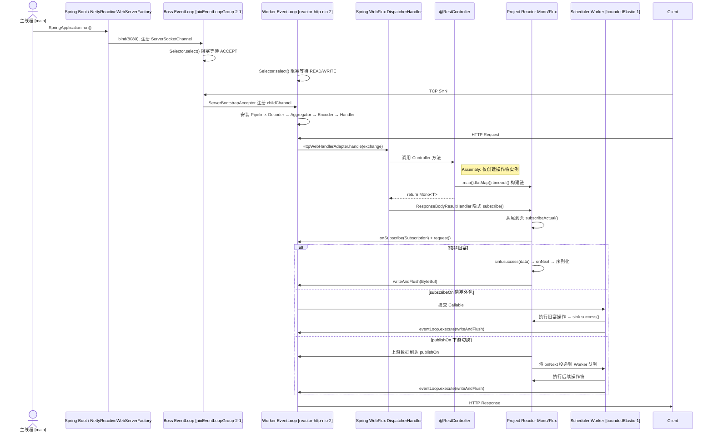

# WebFlux 生命周期与多线程时序

## 一句话定义

WebFlux 服务器通过 Boss/Worker/Scheduler 三类线程分工协作，以 Reactive Streams 的 Subscription 为契约，将 HTTP 请求的处理划分为 Assembly（组装）、Subscription（订阅）、onSubscribe（协议建立）、Emission（数据发射）四个阶段，实现非阻塞的端到端响应式处理。


## 三类核心线程

| 线程角色 | 线程名示例 | 职责 | 对应 Netty 类 |
|---------|-----------|------|--------------|
| **Boss / Acceptor** | `nioEventLoopGroup-2-1` | 监听端口、接收 TCP 连接、分发 SocketChannel | `NioEventLoop` (BossGroup) |
| **Worker / IO** | `reactor-http-nio-2` | HTTP 协议编解码、操作符链 Assembly/Subscription、Channel 写入 | `NioEventLoop` (WorkerGroup) |
| **Scheduler Worker** | `boundedElastic-1` / `parallel-1` | 执行阻塞 IO 或 CPU 密集型任务 | `Schedulers` 内部线程池 |

> 一个 Channel 的生命周期内所有 IO 事件由同一个 Worker EventLoop 处理，避免多线程竞争 Channel 状态。


## 四阶段完整时序

### Phase 1: Assembly（组装期）

**发生时机**：Controller 方法执行期间
**所在线程**：Worker EventLoop
**关键特征**：只创建操作符对象，**无任何数据流动**

```java
// 以下全部在 EventLoop 执行，仅构建操作符链
userRepository.findById(id)     // 返回 MonoCreate
    .map(User::getName)         // → new MonoMap<>(source, mapper)
    .flatMap(name -> ...)       // → new MonoFlatMap<>(source, mapper)
    .timeout(Duration.ofSeconds(3)); // → new MonoTimeout<>(source, timeout)
```

**关键类**：`MonoCreate`、`MonoMap`、`MonoFlatMap`、`MonoTimeout`

### Phase 2: Subscription（订阅期）

**发生时机**：框架拿到 Controller 返回值后，组装响应写入流水线时
**所在线程**：Worker EventLoop
**关键特征**：WebFlux 框架隐式触发订阅，**不是用户代码调用 `.subscribe()`**

```
HttpWebHandlerAdapter.handle(exchange)
  → DispatcherHandler.handle(exchange)
  → RequestMappingHandlerAdapter.handle(exchange, handler)
  → InvocableHandlerMethod.invokeForRequest(...)
  → ResponseBodyResultHandler.handleResult(...)
  → mono.subscribe(subscriber)  // Reactor Netty 隐式触发
```

### Phase 3: onSubscribe（协议建立）

**发生时机**：`subscribe()` 调用后，从尾到头遍历操作符链
**所在线程**：Worker EventLoop
**关键特征**：建立背压契约，下游通过 `Subscription.request(n)` 声明处理能力

```
MonoFlatMap.subscribeActual(downstream)
  → source.subscribe(inner)
MonoMap.subscribeActual(downstream)
  → source.subscribe(inner)
MonoCreate.subscribeActual(downstream)
  → 创建 DefaultMonoSink(downstream)
  → downstream.onSubscribe(DefaultMonoSink)
  → subscription.request(Long.MAX_VALUE)
```

### Phase 4: Emission（数据发射）

**发生时机**：最上游数据源产生数据，向下游推送
**所在线程**：EventLoop（默认）或 Scheduler Worker（有 `publishOn`/`subscribeOn` 时）

**三种场景**：

| 场景 | 触发条件 | 线程路径 |
|------|---------|---------|
| **纯非阻塞** | R2DBC/WebClient 返回数据 | 全在 Worker EventLoop |
| **阻塞 IO 外包** | `Mono.fromCallable(() -> jdbc.query()).subscribeOn(boundedElastic)` | EventLoop → Scheduler Worker → 执行后写回 EventLoop |
| **下游切换** | 链中存在 `.publishOn(Schedulers.parallel())` | 上游在 EventLoop，publishOn 之后切到 parallel |

> 写响应最终必须切回 EventLoop：Netty Channel 线程绑定，Reactor Netty 内部通过 `eventLoop.execute(task)` 自动切换。


## Mermaid 时序图




## 关键辨析

### 1. 没有显式的 `.subscribe()`
在 WebFlux 中，Controller 返回的是未被订阅的 Mono/Flux。真正的订阅由 Reactor Netty 在 `HttpServerOperations` 层隐式触发——当框架把 Controller 返回值、Filter 链、序列化器组装成最终的 `Mono<Void>` 后，Netty 订阅这个 `Mono<Void>`，拉动整个上游流水线执行。

### 2. `DefaultMonoSink` 的双重身份
在 `MonoCreate.subscribeActual()` 中，Reactor 创建 `DefaultMonoSink` 实例。它**既是 `Subscription`（供下游 request/cancel），也是信号发射器（`sink.success()`）**。

### 3. 多线程切换的精确位置
- **`.publishOn(Scheduler)`**：从此操作符开始，**下游的 `onNext` / `onComplete`** 在 Scheduler 线程执行
- **`.subscribeOn(Scheduler)`**：将**最上游的数据源订阅与发射**切换到 Scheduler 线程
- 只有通过上述操作符或阻塞外包时，才会出现第二张线程卡


## 关键关联

- [[Flux核心概念]] -- 关联原因：Assembly 阶段创建的操作符链是 Flux/Mono 的实例化过程，理解操作符的惰性求值是理解生命周期的前提
- [[响应式生命周期信号]] -- 关联原因：onSubscribe/onNext/onComplete 的信号语义在四阶段中有具体的线程归属和触发时机
- [[Reactor-背压与Netty协调]] -- 关联原因：Emission 阶段的跨线程协作依赖 `Subscription.request(n)` 和 Scheduler 任务队列，背压是连接两者的协议层
- [[NIO-Selector]] -- 关联原因：Worker EventLoop 的本质就是 Selector + TaskQueue，理解 NIO 事件循环是理解 WebFlux 线程模型的基础


## 常见误区

| 误区 | 正确理解 |
|------|---------|
| "Assembly 阶段就触发了回调" | Assembly 只创建对象，零数据流动；回调在 Subscription 之后触发 |
| "WebFilter 和 EventLoop 是不同线程" | 默认就是同一个 Worker EventLoop，除非显式 `publishOn` |
| "响应写入不需要 Reactor 接口" | `ServerHttpResponse.writeWith(Publisher<DataBuffer>)` 仍通过 Reactive Streams 协调背压 |
| "每个请求创建操作符链是浪费" | 操作符实例持有请求级状态（内部队列、完成标志），必须隔离；函数逻辑和线程池是复用的 |


---

## 🤖 AI评价

### 掌握度评估
- 当前等级：🍎 应用（接近掌握）
- 已理解：
  - ✅ 三类线程的分工与 Netty 对应关系
  - ✅ 四阶段的具体类和方法
  - ✅ 隐式订阅的触发位置
  - ✅ 多线程切换的精确位置和机制
  - ✅ 写响应最终切回 EventLoop 的原因
- 下一步：结合源码验证 `MonoSendMany` 和 `FluxReceive` 的具体实现
