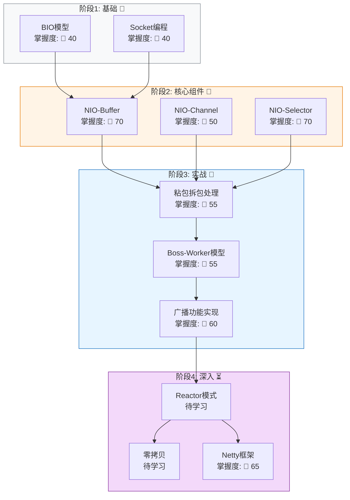

# MOC: NIO 网络编程

> Java NIO 与网络编程知识地图
> **学习路径可视化版本**


## 学习路径（从前置到深入）




## 前置知识要求

| 知识 | 必需程度 | 来源 |
|------|---------|------|
| Java并发基础 | 必须 | [[Java多线程]] |
| 阻塞与非阻塞概念 | 必须 | [[BIO-BlockingIO]] |
| TCP/IP协议基础 | 推荐 | [[TCP协议]] |


## 学完后能做什么

- [x] 构建NIO聊天室（已完成）
- [x] 实现多客户端广播
- [ ] 构建高性能HTTP服务器
- [ ] 学习Netty源码


## 核心概念

| 概念 | 一句话描述 | 掌握状态 | 对应阶段 |
|-----|-----------|---------|---------|
| [[BIO-BlockingIO]] | 阻塞IO模型，一连接一线程 | 🌿 40 | 阶段1 |
| [[NIO-Buffer]] | 带状态管理的智能数据容器（position/limit/capacity） | 🍎 70 | 阶段2 |
| [[NIO-Channel]] | 双向非阻塞IO通道，连接Buffer与网络 | 🌿 50 | 阶段2 |
| [[NIO-Selector]] | 多路复用器，单线程管理多连接（epoll实现） | 🍎 70 | 阶段2 |
| [[粘包拆包]] | TCP字节流无消息边界，应用层必须自行分割 | 🌿 55 | 阶段3 |
| [[Boss-Worker模型]] | Boss线程accept，Worker线程处理读写 | 🌿 55 | 阶段3 |
| [[OP_WRITE事件处理]] | 只在待发送数据时注册，发送完取消 | 🌿 55 | 阶段3 |
| [[NIO优雅关闭模式]] | 先标志位、再wakeup、最后强制关闭的三阶段模式 | 🌿 55 | 阶段3 |
| [[跨线程通信]] | 使用ConcurrentLinkedQueue + selector.wakeup() | 🌿 55 | 阶段3 |
| [[Netty]] | 基于NIO的高性能异步事件驱动网络框架 | 🍎 65 | 阶段4 |
| [[Reactor模式]] | 高性能网络服务器的核心设计模式 | ⏳ 待学 | 阶段4 |


## 知识网络（Obsidian Graph View）

```dataview
table status, file.mtime as "更新时间"
from #nio
sort file.mtime desc
```


## 项目实战

| 项目 | 描述 | 状态 |
|------|------|------|
| [[bio-chatroom]] | BIO阻塞模型聊天室，理解一连接一线程的局限性 | ✅ 完成 |
| [[nio-chatroom]] | NIO非阻塞模型聊天室，实践Selector + Buffer + 多线程架构 | ✅ 完成 |
| NIO文件传输 | 零拷贝 + 内存映射文件实践 | ⏳ 待开始 |


## 我的误区档案

| 编号 | 错误 | 关联概念 |
|------|------|---------|
| [[MISTAKE-001-SocketEOFDeadloop]] | 将 `read()=-1` 误解为消息结束，导致死循环 | [[Socket-EOF-Semantics]] |
| [[MISTAKE-002-NIO-RaceCondition-Register]] | Worker注册竞态条件导致客户端静默丢失 | [[Boss-Worker模型]]、[[Race-Condition]] |
| [[MISTAKE-003-NIO-ByteBuffer-Mode]] | `wrap()`后再`flip()`导致数据错位 | [[NIO-Buffer]]、[[粘包拆包]] |
| [[MISTAKE-004-NIO-CancelledKeyException]] | 操作已取消的Key导致异常 | [[NIO-Selector]]、[[NIO优雅关闭模式]] |


## 对话反思记录

- [[2026-04-17-NIO学习对话]] — NIO三大组件基础概念学习
- [[2026-04-19-nio-partial-write-question]] — NIO部分发送的疑问（待深入研究）
- [[2026-04-21-nio-chatroom-debug]] — NIO聊天室广播调试实录（4个连锁Bug）
- [[2026-04-24-netty-learning-dialogue]] — Netty框架核心概念学习（EventLoop、Pipeline、ByteBuf）


## 练习记录

- [[2026-04-19-broadcast-implementation]] — 广播功能实现与Bug修复


## 学习进度

- [x] BIO聊天室项目（理解阻塞模型局限性）
- [x] NIO三大组件基础概念（Buffer、Channel、Selector）
- [x] NIO聊天室项目（实践多线程架构、广播功能）
- [x] 消息协议设计（长度前缀协议）
- [x] 粘包/拆包处理（compact模式）
- [x] 写半包处理（OP_WRITE事件管理）
- [x] 跨Worker广播设计（队列+wakeup）
- [x] Netty框架学习（事件循环、Pipeline、ByteBuf）
- [x] Netty项目实战（聊天室 Phase 1/2）
- [ ] 零拷贝技术（mmap、sendfile）
- [ ] 性能优化（背压、流量控制）
- [ ] 知识网络密度检查（每个节点≥2个链接）


## 能力评估

| 维度            | 当前等级       | 趋势  |
| ------------- | ---------- | --- |
| NIO-Buffer    | 🍎 应用 (70) | ↗️  |
| NIO-Selector  | 🍎 应用 (70) | ↗️  |
| NIO-Channel   | 🌿 理解 (50) | →   |
| Boss-Worker模型 | 🌿 理解 (55) | ↗️  |
| Netty         | 🍎 应用 (65) | ↗️  |
| 网络编程综合        | 85分        | ↗️  |


---
📊 **网络密度**: 检查中
🎯 **下一步**: Netty框架学习 / 零拷贝技术
