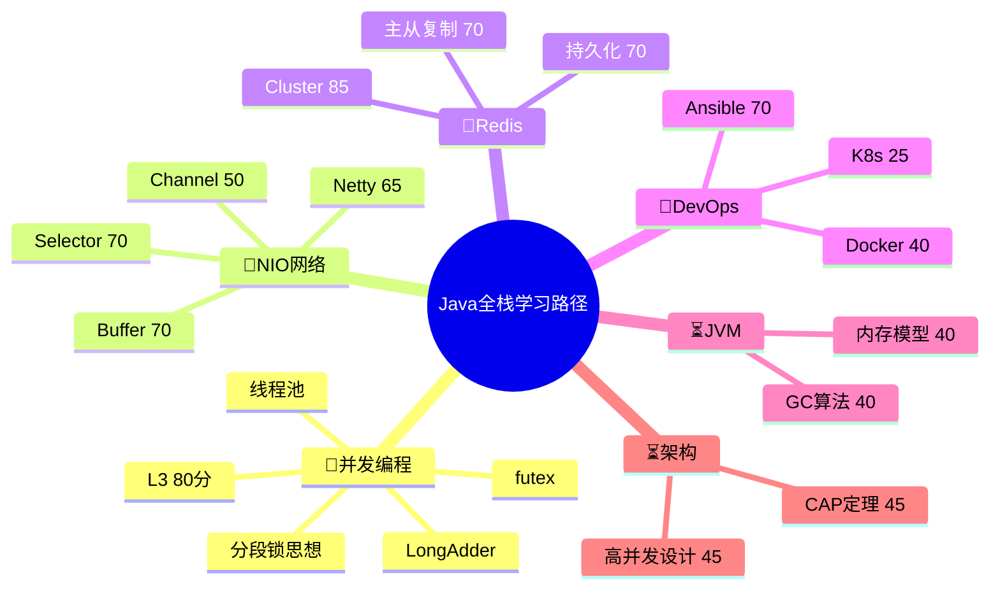
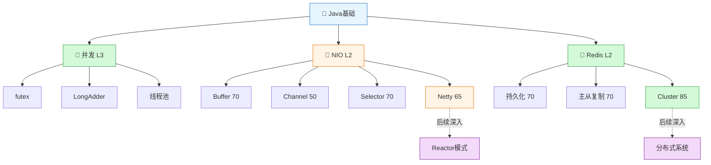
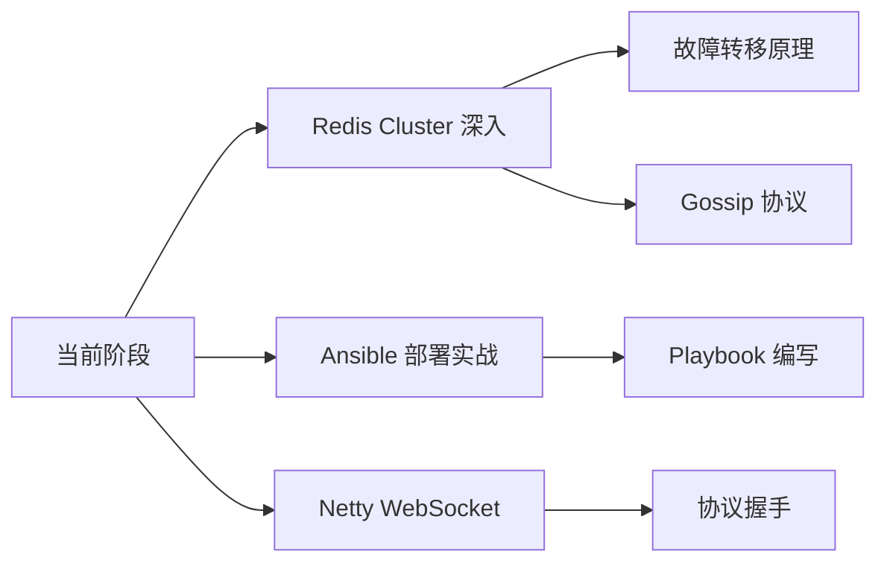
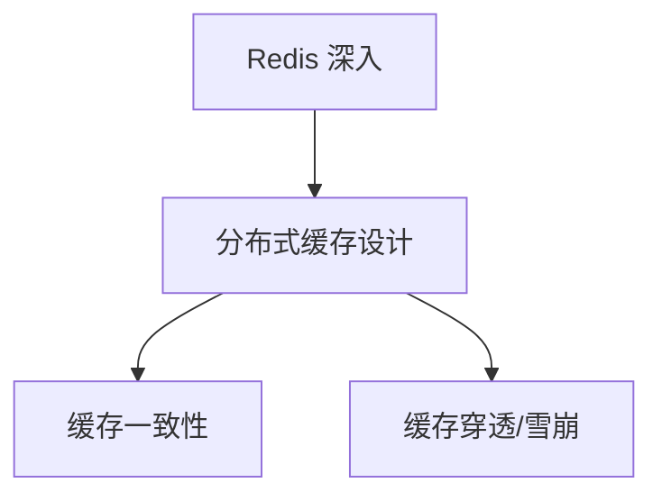
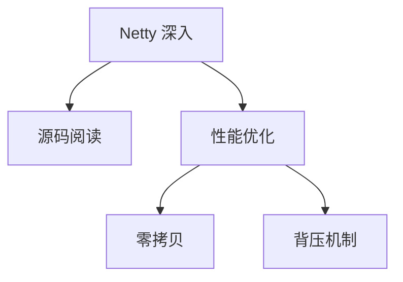

# Java 学习路径图谱

> 基于 profile.md 和 current.json 自动生成
> 展示学习深度递进与分支选择

---

## 学习路径总览（Mermaid Mindmap）

### 传统Flowchart视图

---

## 学习深度指标

| 专题 | 深度等级 | 掌握度 | 状态 |
|------|---------|--------|------|
| 并发编程 | L3 | 80/100 | 🍎 已掌握 |
| NIO/网络 | L2 | 65/100 | 🍎 应用中 |
| Redis | L2 | 70-85/100 | 🍎 应用中 |
| DevOps | L1-L2 | 40-70/100 | 🌿 学习中 |
| JVM | L1 | 40/100 | ⏳ 待学习 |
| 架构设计 | L1 | 45/100 | ⏳ 待学习 |
| 分布式 | L1 | 30/100 | ⏳ 待学习 |

---

## 当前学习焦点

---

## 下一步推荐路径

### 路径A: 纵向深入

### 路径B: 横向拓展

---

## 与XMind对比

| 维度 | XMind | 当前MOC |
|------|-------|---------|
| 层级展示 | 树状展开，清晰直观 | 扁平列表+双向链接 |
| 学习进度 | 手动维护，容易直观 | AI驱动，需要图谱视图 |
| 路径指引 | 颜色/图标标注深度 | 需要在Graph View中探索 |
| 知识关联 | 需要手动建立 | 自动双向链接 |

---

## 图谱使用建议

1. **在 Obsidian 中打开 Graph View**，用过滤器只看当前正在学习的专题
2. **用 Excalidraw 插件**手绘学习路径的层级关系
3. **每完成一个主题**，在对应MOC中更新学习进度
4. **用标签系统**(`#learning #done #in-progress`)追踪状态

---

*生成时间: 2026-05-06*
*数据来源: .agent/profile.md, .agent/assessment/current.json*
