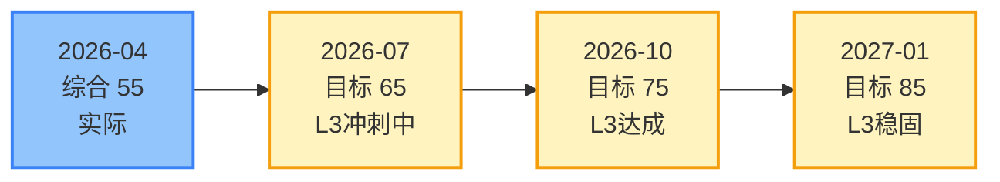

# MOC：能力雷达图

> 本MOC基于《高级Java后端开发人员能力评价体系》的五维模型，可视化展示当前能力状态和成长轨迹。
> 
> 评估档案：`.agent/assessment/current.json`

---

## 当前能力概览

### 综合成熟度

| 指标 | 值 |
|------|-----|
| **当前等级** | L2（熟练级）→ L3（精通级）进行中 |
| **综合得分** | {{待填入}} / 100 |
| **上次评估** | {{待填入}} |
| **下次评估** | 2026-07-14（季度复盘） |

### 五维能力对比

![[radar-dataviewjs]]

**当前状态**：综合 L2，核心技术最强（65分），工程素养最弱（35分），目标 L3 需五维均达 75 分。

---

## 维度详情

### 1. 核心技术知识深度（Core Technology）

**当前等级**：L2.5 | **得分**：65/100 | **趋势**：↗️ 上升

| 子维度 | 等级 | 得分 | 关键证据 |
|--------|------|------|---------|
| 并发编程 | L3 | 80 | [[futex]]、[[LongAdder]]、[[线程池]]等10+原子笔记 |
| JVM原理 | L1 | 40 | 待学习 |
| NIO/网络 | L1 | 50 | 计划中 |
| 分布式理论 | L1 | 30 | 待学习 |

**能力缺口**：
- JVM内存模型、GC调优
- NIO三大组件、Reactor模式
- CAP定理、分布式事务

**下阶段目标**：
- [ ] NIO达到L2.5（完成NIO聊天室项目）
- [ ] JVM达到L2（完成GC日志分析案例）

---

### 2. 问题分析与解决能力（Problem Solving）

**当前等级**：L2 | **得分**：55/100 | **趋势**：→ 稳定

| 子维度 | 等级 | 得分 | 关键证据 |
|--------|------|------|---------|
| 故障排查 | L2 | 55 | [[2026-04-11-futex-dialogue]]（根因追溯） |
| 监控日志 | L1 | 40 | 待实践 |
| 系统性思维 | L2 | 60 | 分段锁思想的应用 |

**能力缺口**：
- 真实线上故障排查经验
- 监控体系（Metrics/Logs/Traces）
- 故障复盘方法论

**下阶段目标**：
- [ ] 完成至少1次模拟故障演练（使用[[故障复盘模板]]）

---

### 3. 架构设计与权衡能力（Architecture）

**当前等级**：L1.5 | **得分**：45/100 | **趋势**：↗️ 上升

| 子维度 | 等级 | 得分 | 关键证据 |
|--------|------|------|---------|
| 高并发设计 | L2 | 50 | project-concurrency-test |
| CAP权衡 | L1 | 30 | 待学习 |
| 技术选型 | L1 | 40 | 待实践 |

**能力缺口**：
- 分布式系统架构设计
- CAP/BASE理论应用
- 技术选型决策框架

**下阶段目标**：
- [ ] 完成1次架构评审（使用[[架构评审模板]]）

---

### 4. 工程素养与实践能力（Engineering）

**当前等级**：L1 | **得分**：35/100 | **趋势**：↗️ 起步

| 子维度 | 等级 | 得分 | 关键证据 |
|--------|------|------|---------|
| 容器化 | L1 | 30 | 待学习 |
| K8s | L1 | 25 | 待学习 |
| CI/CD | L1 | 35 | 待学习 |
| 可观测性 | L1 | 30 | 待学习 |

**能力缺口**：
- Docker容器化
- Kubernetes基础
- CI/CD流程设计
- 监控告警体系

**下阶段目标**：
- [ ] Docker达到L2（容器化一个现有项目）

---

### 5. 持续学习与能力提升（Learning）

**当前等级**：L2 | **得分**：60/100 | **趋势**：↗️ 上升

| 子维度 | 等级 | 得分 | 关键证据 |
|--------|------|------|---------|
| 知识内化 | L2 | 60 | 10+原子笔记、MOC体系 |
| 方法论沉淀 | L2 | 55 | 分段锁思想、错误模式识别 |
| 影响力建设 | L1 | 40 | 个人学习，暂无对外输出 |

**能力缺口**：
- 定量化的成长追踪（正在建设）
- 技术分享/博客输出

**下阶段目标**：
- [ ] 建立完整的评估-学习-复盘闭环（本MOC）

---

## 成长轨迹

### 历史评估记录

| 日期 | 综合等级 | 综合得分 | 评估档案 |
|------|---------|---------|---------|
| 2026-04-14 | L2 | -- | `baseline-2026-04.json` |
| 2026-07-14 | -- | -- | `baseline-2026-07.json`（待生成） |

### 成长曲线

### 成长里程碑

### 历史得分记录

| 日期 | 实际得分 | 目标得分 | 状态 |
|------|---------|---------|------|
| 2026-04 | 55 | 55 | ✅ 基线 |
| 2026-07 | -- | 65 | 🎯 目标 |
| 2026-10 | -- | 75 | 🎯 目标 |
| 2027-01 | -- | 85 | 🎯 目标 |

---

## 学习路径推荐

基于当前能力缺口，下阶段学习优先级：

### 高优先级（立即开始）

1. **NIO专题**（核心技术）
   - 原因：并发已掌握，NIO是网络编程基础，与已有知识关联度高
   - 目标：达到L2.5
   - 产出：NIO聊天室项目 + 评估卡片

2. **评估体系建设**（持续学习）
   - 原因：建立量化反馈机制，解决TODOLIST痛点
   - 目标：完成基础设施搭建
   - 产出：current.json + 4个模板

### 中优先级（下一阶段）

3. **Docker容器化**（工程素养）
   - 原因：补齐DevOps短板，为后续K8s打基础
   - 目标：达到L2
   - 产出：容器化项目 + 部署文档

4. **JVM原理**（核心技术）
   - 原因：Java根基，与并发知识互补
   - 目标：达到L2
   - 产出：GC调优案例分析

### 低优先级（长期规划）

5. **分布式理论**（架构设计）
6. **Kubernetes**（工程素养）

---

## 关联资源

### 评估档案
- 当前评估：`.agent/assessment/current.json`
- 基线评估：`.agent/assessment/baseline-2026-04.json`
- Schema定义：`.agent/assessment/schema.json`

### 评估模板
- [[项目评估卡片模板]]
- [[架构评审模板]]
- [[故障复盘模板]]
- [[季度能力复盘模板]]

### 项目评估卡片索引
> 按时间倒序排列

- {{待生成}}

### 错误档案索引
> 按时间倒序排列

- {{待整理}}

---

## 更新记录

| 日期 | 更新内容 | 更新者 |
|------|---------|--------|
| 2026-04-14 | 初始创建，建立五维评估框架 | AI |
| {{日期}} | {{内容}} | {{更新者}} |

---

*本MOC基于评价体系第5章可视化呈现设计*
*关联：[[MOC-学习路径图]]、[[skill-heatmap]]*
